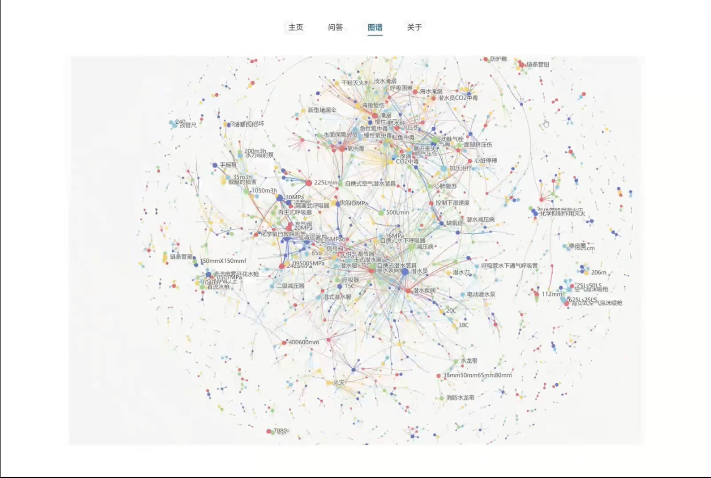
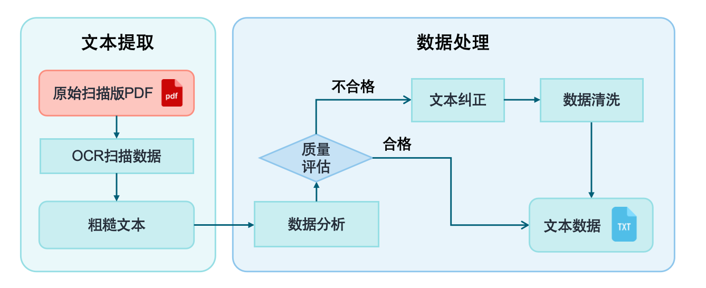
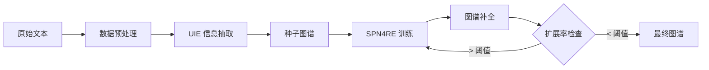

<div align="center">

# 🧠 ChatKG - Knowledge Graph-based LLM Dialog System

[](https://www.python.org/)
[](https://pytorch.org/)
[](https://www.paddlepaddle.org.cn/)
[](https://vuejs.org/)
[](LICENSE)

**基于知识图谱和知识库的大模型对话系统**

*Combining Knowledge Graph Construction, Graph Completion, and ChatGLM for Intelligent Q&A*

[功能特点](#-功能特点) • [快速开始](#-快速开始) • [系统架构](#-系统架构) • [常见问题](#-常见问题) • [配置说明](#-配置说明)

</div>

---

## 📺 Demo 展示

<div align="center">

https://github.com/littlewwwhite/KnowledgeGraph-based-on-Raw-text-A27/assets/34784086/aa089b51-0b88-4d2b-b7fe-d892c503e55c

</div>

<table>
<tr>
<td width="50%">

### 💬 智能对话界面


</td>
<td width="50%">

### 🔗 知识图谱可视化


</td>
</tr>
</table>

---

## ✨ 功能特点

<table>
<tr>
<td>

### 🎯 核心功能

- **智能问答** - 基于 ChatGLM-6B 的多轮对话
- **知识检索** - 结合知识图谱的精准信息检索
- **图谱可视化** - 交互式知识图谱展示
- **实体关联** - 自动展示相关实体和上下文

</td>
<td>

### 🛠️ 技术特性

- **UIE 抽取** - PaddleNLP 通用信息抽取
- **SPN4RE** - 关系三元组联合抽取模型
- **图谱补全** - 迭代式知识图谱扩展
- **流式输出** - 实时响应的对话体验

</td>
</tr>
</table>

---

## 🏗️ 系统架构

### 整体流程

项目包含 **5 个核心模块**：数据预处理 → 图谱构建 → 图谱补全 → 对话模型 → 网页呈现

<div align="center">


</div>

---

### 1️⃣ 数据预处理

将原始文本数据进行清洗、分句、标准化处理，为后续的信息抽取做准备。

<div align="center">



</div>

---

### 2️⃣ 种子图谱构建

利用 PaddleNLP UIE 模型和 ChatGPT 定义的关系 Schema 构建初始知识图谱。

<div align="center">


</div>

---

### 3️⃣ 图谱补全迭代

通过 SPN4RE 模型对种子图谱进行迭代补全，逐步扩展知识覆盖范围。

<div align="center">


</div>

---

### 4️⃣ 对话服务

基于 ChatGLM-6B 构建问答服务，结合知识图谱实现精准检索与智能回答。

<div align="center">


</div>

---

### 5️⃣ 前端界面

使用 Vue 3 + ECharts 构建现代化的交互界面，支持对话与图谱可视化。

<div align="center">


</div>

---

## 🚀 快速开始

### 环境要求

| 组件 | 版本要求 | 说明 |
|------|---------|------|
| Python | 3.8+ | 推荐 3.8.16 |
| PyTorch | 1.10+ | 需支持 CUDA |
| PaddlePaddle | 2.4+ | GPU 版本 |
| Node.js | 16+ | 前端构建 |
| GPU | NVIDIA 3090 | 推荐双卡，显存 24GB+ |

### 1. 克隆项目

```bash
git clone https://github.com/littlewwwhite/KnowledgeGraph-based-on-Raw-text-A27.git
cd KnowledgeGraph-based-on-Raw-text-A27
```

### 2. 安装后端依赖

> ⚠️ **重要**: 请严格按照以下顺序安装依赖，避免版本冲突

```bash
# 创建虚拟环境 (推荐使用 conda)
conda create -n chatkg python=3.8.16
conda activate chatkg

# 或者使用 venv
python3.8 -m venv .venv
source .venv/bin/activate  # Linux/macOS
# .venv\Scripts\activate   # Windows

# 1. 首先安装 PyTorch (根据 CUDA 版本选择)
# CUDA 11.3
pip install torch==1.11.0+cu113 torchvision==0.12.0+cu113 -f https://download.pytorch.org/whl/torch_stable.html

# CUDA 11.6
pip install torch==1.12.0+cu116 torchvision==0.13.0+cu116 -f https://download.pytorch.org/whl/torch_stable.html

# 2. 安装 PaddlePaddle GPU 版本
# CUDA 11.2
pip install paddlepaddle-gpu==2.4.2.post112 -f https://www.paddlepaddle.org.cn/whl/linux/mkl/avx/stable.html

# CUDA 11.6
pip install paddlepaddle-gpu==2.4.2.post116 -f https://www.paddlepaddle.org.cn/whl/linux/mkl/avx/stable.html

# 3. 安装其他依赖
pip install -r requirements.txt
```

### 3. 配置环境变量

```bash
# 复制配置模板
cp .env.example .env

# 编辑配置
vim .env  # 或使用任意编辑器
```

**必须配置的项目：**

```bash
# 模型路径 - 可以是本地路径或 HuggingFace 模型名
CHATGLM_MODEL_PATH=THUDM/chatglm-6b
# 或者本地路径: CHATGLM_MODEL_PATH=/path/to/chatglm-6b

# GPU 配置
CUDA_VISIBLE_DEVICES=0

# 服务端口
SERVER_PORT=8000
```

### 4. 准备数据

```bash
# 将原始文本数据放入 data/raw_data/ 目录
cp your_data.txt data/raw_data/raw_data.txt
```

### 5. 构建知识图谱

```bash
# 运行知识图谱构建流程
python main.py --project my_project --gpu 0

# 从检查点恢复 (如果之前中断)
python main.py --project my_project --resume checkpoint_v3 --gpu 0
```

### 6. 准备对话服务数据

```bash
# 将生成的知识图谱复制到 server/data/
cp data/project_v1/iter_vN.json server/data/data.json
```

> 💡 **说明**: `iter_vN.json` 是最终迭代版本的知识图谱文件，N 为迭代次数

### 7. 启动后端服务

```bash
cd server
python main.py
# 服务将启动在 http://localhost:8000
```

### 8. 启动前端界面

```bash
cd chat-kg

# 安装依赖
npm install

# 开发模式
npm run dev
# 访问 http://localhost:5173

# 生产构建
npm run build
npm run preview
```

---

## ❓ 常见问题

### Q1: 依赖包版本冲突怎么办？

**问题**: 安装依赖时出现版本冲突错误

**解决方案**:

```bash
# 1. 创建全新的虚拟环境
conda create -n chatkg python=3.8.16 -y
conda activate chatkg

# 2. 按顺序安装核心依赖
pip install torch==1.11.0+cu113 -f https://download.pytorch.org/whl/torch_stable.html
pip install paddlepaddle-gpu==2.4.2.post112 -f https://www.paddlepaddle.org.cn/whl/linux/mkl/avx/stable.html
pip install transformers==4.27.0
pip install paddlenlp==2.5.2

# 3. 安装其他依赖
pip install flask flask-cors numpy pandas wikipedia opencc-python-reimplemented
```

### Q2: inference.pdmodel 文件缺失？

**问题**: 启动 server 时提示 `inference.pdmodel` 文件不存在

**解决方案**:

```bash
# 1. 确保 PaddleNLP 正确安装
pip install paddlenlp==2.5.2 --force-reinstall

# 2. 手动下载 UIE 模型
python -c "from paddlenlp import Taskflow; ie = Taskflow('information_extraction', schema=['实体'])"

# 3. 如果仍然失败，检查网络并重试
# 模型会下载到 ~/.paddlenlp/taskflow/
```

### Q3: knowledge_graph.json 如何转换为 data.json？

**问题**: 不清楚如何从初步图谱生成服务所需的数据文件

**解决方案**:

1. 运行 `main.py` 完成图谱构建迭代
2. 在 `data/project_v1/` 目录下找到最新的 `iter_vN.json`
3. 复制到 server 目录:

```bash
cp data/project_v1/iter_v5.json server/data/data.json
```

### Q4: 数据预处理代码在哪里？

**解决方案**:

数据预处理代码位于 `modules/prepare/` 目录:

- `preprocess.py` - 文本清洗和分句
- `process.py` - UIE 信息抽取
- `filter.py` - 三元组过滤验证

使用方式已集成在 `main.py` 的 `get_base_kg_from_txt()` 方法中。

### Q5: GPU 显存不足？

**解决方案**:

```bash
# 1. 减小批次大小
# 编辑 .env 文件
BATCH_SIZE=4  # 或更小

# 2. 使用 CPU 推理 (较慢但可行)
CUDA_VISIBLE_DEVICES=""

# 3. 使用量化模型
# 在 server/app/utils/chat_glm.py 中启用 int4 量化
```

### Q6: 前端无法连接后端？

**解决方案**:

```bash
# 1. 确认后端服务已启动
curl http://localhost:8000/

# 2. 检查端口配置
# chat-kg/.env.local
VITE_API_URL=http://localhost:8000

# 3. 检查 CORS 配置
# server 已默认启用 CORS
```

---

## 📖 使用指南

### 知识图谱构建流程



### 命令行参数

```bash
python main.py [OPTIONS]

Options:
  --project TEXT    项目名称，用于数据隔离 (default: project_v1)
  --resume TEXT     从指定检查点恢复训练
  --gpu TEXT        使用的 GPU ID (default: 0)
```

### API 接口

| 端点 | 方法 | 描述 |
|------|------|------|
| `/chat` | POST | 发送对话请求 |
| `/graph` | GET | 获取知识图谱数据 |
| `/entity/<name>` | GET | 查询实体信息 |

**对话请求示例：**

```bash
curl -X POST http://localhost:8000/chat \
  -H "Content-Type: application/json" \
  -d '{"prompt": "什么是损管技术?", "history": []}'
```

---

## ⚙️ 配置说明

### 环境变量完整列表

<details>
<summary><b>📋 点击展开完整配置项</b></summary>

| 变量名 | 默认值 | 说明 |
|--------|--------|------|
| **路径配置** | | |
| `DATA_DIR` | `./data` | 数据目录 |
| `RAW_DATA_PATH` | `./data/raw_data/raw_data.txt` | 原始数据文件 |
| **模型配置** | | |
| `CHATGLM_MODEL_PATH` | `THUDM/chatglm-6b` | ChatGLM 模型路径 |
| `BERT_MODEL_NAME` | `bert-base-chinese` | BERT 模型名称 |
| `UIE_MODEL_NAME` | `uie-base` | UIE 模型名称 |
| **训练配置** | | |
| `TRAIN_RATIO` | `0.5` | 训练集比例 |
| `VALID_RATIO` | `0.2` | 验证集比例 |
| `MAX_EPOCH` | `10` | 最大训练轮数 |
| `BATCH_SIZE` | `8` | 批次大小 |
| `MAX_ITERATION` | `10` | 图谱扩展最大迭代次数 |
| `EXTEND_RATIO_THRESHOLD` | `0.01` | 扩展率阈值 |
| **GPU 配置** | | |
| `CUDA_VISIBLE_DEVICES` | `0` | 可见 GPU 设备 |
| `DEFAULT_GPU` | `0` | 默认 GPU |
| **服务配置** | | |
| `SERVER_HOST` | `0.0.0.0` | 服务监听地址 |
| `SERVER_PORT` | `8000` | 服务端口 |
| `SECRET_KEY` | 随机生成 | Flask 密钥 (生产环境必须设置) |
| `DEBUG` | `false` | 调试模式 |

</details>

### Schema 配置

系统支持多版本关系 Schema，在 `data/schema/` 目录下定义：

```python
# data/schema/schema_v4.py
schema = {
    "实体类型": ["设备", "人员", "技术", "方法", "材料"],
    "关系类型": {
        "设备": ["组成部分", "功能", "位置"],
        "技术": ["应用于", "依赖", "包含"],
        # ...
    }
}
```

---

## 📁 项目结构

```
KnowledgeGraph-based-on-Raw-text-A27/
├── 📂 chat-kg/               # Vue 3 前端项目
│   ├── src/
│   │   ├── components/       # 组件 (MessageList, InfoPanel, etc.)
│   │   ├── views/            # 页面视图
│   │   └── assets/           # 样式和资源
│   └── package.json
├── 📂 config/                # 配置管理
│   └── settings.py           # 集中式配置
├── 📂 data/                  # 数据目录
│   ├── raw_data/             # 原始文本数据
│   ├── schema/               # 关系 Schema 定义
│   └── project_*/            # 项目数据 (自动生成)
├── 📂 docs/                  # 文档和资源
│   ├── images/               # README 图片资源
│   └── notebooks/            # Jupyter 示例笔记本
├── 📂 modules/               # 核心模块
│   ├── knowledge_graph_builder.py  # 图谱构建器
│   ├── model_trainer.py      # SPN4RE 训练器
│   ├── prepare/              # 数据预处理
│   ├── SPN4RE/               # 关系抽取模型
│   └── utils/                # 工具函数
├── 📂 server/                # Flask 后端
│   ├── app/                  # Flask 应用
│   │   ├── utils/            # 工具模块 (ChatGLM, NER, etc.)
│   │   └── views/            # API 视图
│   ├── data/                 # 运行时数据 (data.json)
│   └── main.py               # 服务入口
├── 📂 tests/                 # 测试用例
├── 📜 main.py                # 主入口
├── 📜 requirements.txt       # Python 依赖
└── 📜 .env.example           # 环境变量模板
```

---

## 🔧 技术栈

<table>
<tr>
<th>后端</th>
<th>前端</th>
<th>AI/ML</th>
</tr>
<tr>
<td>

- Python 3.8+
- Flask
- Flask-CORS

</td>
<td>

- Vue 3 (Composition API)
- Vite
- ECharts
- Ant Design Vue

</td>
<td>

- PyTorch
- PaddleNLP (UIE)
- Transformers
- ChatGLM-6B
- SPN4RE

</td>
</tr>
</table>

---

## 📊 数据来源与标注

### 数据来源

| 数据集 | 描述 |
|--------|------|
| 《舰艇损管和潜水技术》 | 初始核心数据 |
| 《舰船损管技术》 | 扩充数据集 |

### 数据标注流程

1. **初始标注** - 使用 [Doccano](https://github.com/doccano/doccano) 标注约 100 条样本
2. **UIE 抽取** - 利用标注数据微调 UIE 模型进行初次抽取
3. **二次标注** - 针对抽取效果较差的部分进行修正和补充标注
4. **迭代优化** - 重复上述流程直至抽取质量满足要求

---

## 🧪 测试

```bash
# 运行所有测试
pytest

# 运行特定模块测试
pytest tests/test_settings.py -v

# 查看测试覆盖率
pytest --cov=modules tests/
```

---

## 📝 开发指南

### 添加新的关系 Schema

1. 在 `data/schema/` 创建新的 schema 文件 (如 `schema_v5.py`)
2. 定义实体类型和关系类型
3. 在 `.env` 中设置 `SCHEMA_VERSION=v5`

### 前端开发

```bash
cd chat-kg
npm run dev       # 开发服务器
npm run build     # 生产构建
npm run lint      # 代码检查
```

---

## 🤝 贡献

欢迎提交 Issue 和 Pull Request！

1. Fork 本仓库
2. 创建特性分支 (`git checkout -b feature/AmazingFeature`)
3. 提交更改 (`git commit -m 'Add some AmazingFeature'`)
4. 推送到分支 (`git push origin feature/AmazingFeature`)
5. 开启 Pull Request

---

## 📄 License

本项目采用 MIT 许可证 - 详见 [LICENSE](LICENSE) 文件

---

<div align="center">

**⭐ 如果这个项目对你有帮助，请给一个 Star！**

Made with ❤️ by [littlewwwhite](https://github.com/littlewwwhite)

</div>
