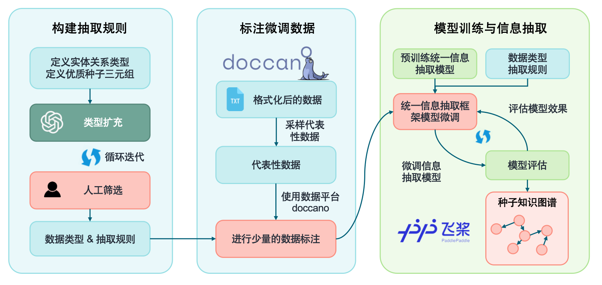
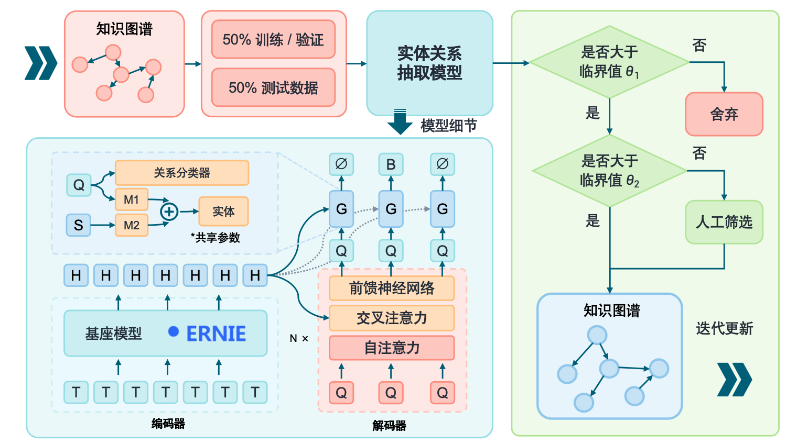
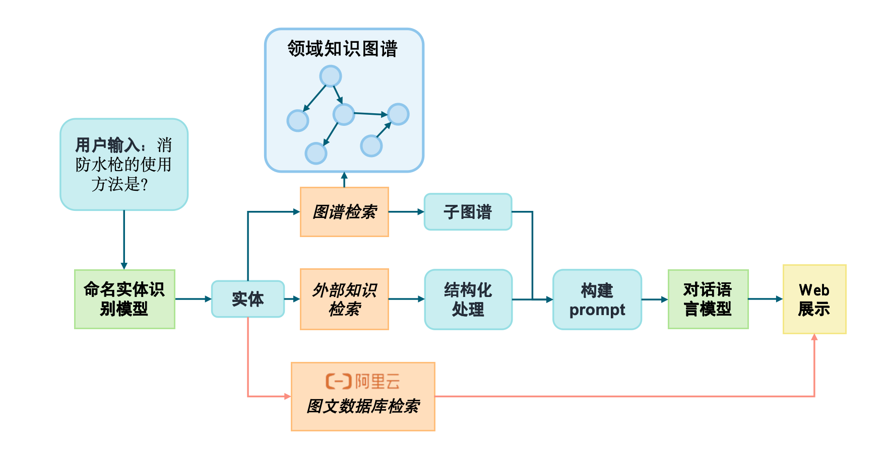
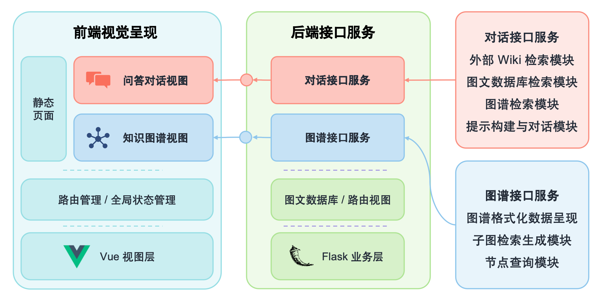

# 基于知识图谱和知识库的大模型对话系统

## Demo1-chat 功能
[![chat]!(demo/demo-chat.png)](https://github.com/littlewwwhite/KnowledgeGraph-based-on-Raw-text-A27/raw/main/demo/video-demo-chat.mp4)
<video src="https://github.com/littlewwwhite/KnowledgeGraph-based-on-Raw-text-A27/raw/main/demo/video-demo-chat.mp4" width="640" height="480" controls></video>
<!-- <video controls src="demo/demo_video.mp4" title="Demo"></video> -->

## Demo2-KG 展示

<video src="https://github.com/littlewwwhite/KnowledgeGraph-based-on-Raw-text-A27/raw/main/demo/video-demo-kg.mp4" width="640" height="480" controls></video>

## 项目整体流程介绍
#### 项目整体包含5个部分：数据预处理、图谱构建、图谱补全、对话模型、网页呈现

### 首先是数据预处理的逻辑

### 然后利用数据和ChatGPT定义的规则构建种子知识图谱

### 接着对种子知识图谱进行补全操作（需要对自己的数据进一步的筛选，有更深的认知）

### 利用chatglm-6b作为核心模型，基于flask构建后端的对话模型

### 前端界面构建和项目部署

## 环境配置

---
python                    3.8.16
torch                     1.11.0+cu113~
paddlenlp                 2.5.1
paddlepaddle-gpu          2.3.2
transformer               **2.6.0**

## 初始模型：
---
知识种子图图谱模型：paddlenlp-model-zoo-uie
所用模型类型：'information extraction'

##  训练模型：SPN4RE-NYT—exact
---
训练集占比：50%
验证集占比：10%
测试集占比：40%

## 数据来源：
---
初始数据：《舰艇损管和潜水技术》
扩充数据：《舰船损管技术》等

## 数据标注
利用doccanco标注不同类型的数据大约100条作为微调uie的初始数据，在uie进行初次抽取后，针对数据中效果较差的部分进行二次标注微调。

## 训练设备：3090 * 2

