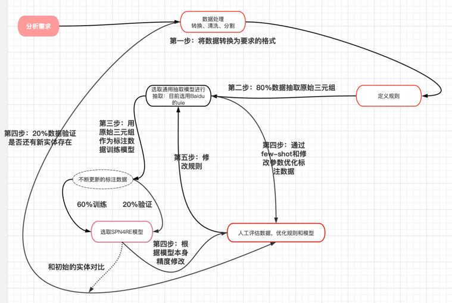

# fuchuang-kg
江南大学服务创新外包项目，题号A27

## 项目流程介绍



## 环境配置

---

python                    3.8.16

torch                     1.11.0+cu113~

paddlenlp                 2.5.1

paddlepaddle-gpu          2.3.2

transformer               **2.6.0**


## 初始模型：
---
知识种子图图谱模型：paddlenlp-model-zoo-uie
所用模型类型：'information extraction'


##  训练模型：SPN4RE-NYT—exact
---
训练集占比：40%
验证集占比：10%
测试集占比：50%

batchsize, epoch以及其他训练数据


## 数据来源：
---
初始数据：《舰艇损管和潜水技术》
扩充数据：《舰船损管技术》

## 数据标注

```py
python prepare/utils.py
```


## 训练设备：3090

